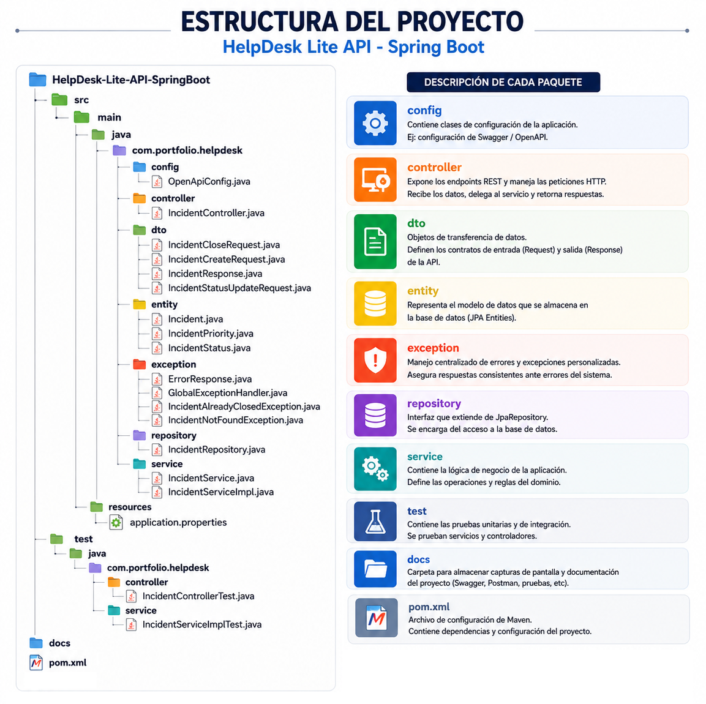
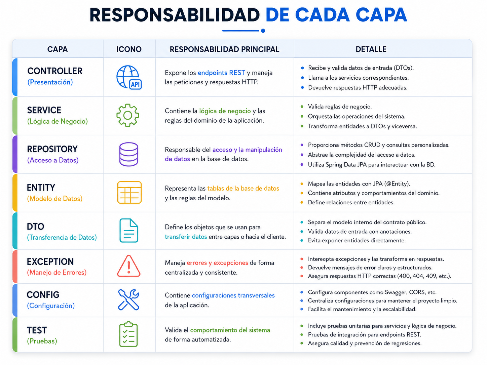

# HelpDesk Lite API - Spring Boot

API REST para la gestión de incidencias técnicas desarrollada con Java, Spring Boot, PostgreSQL, Swagger/OpenAPI, JUnit, Mockito y MockMvc.

Este proyecto forma parte de un portafolio profesional orientado a demostrar conocimientos en desarrollo Backend Java, arquitectura por capas, pruebas automatizadas, documentación de APIs y buenas prácticas de desarrollo.

---

## Objetivo del proyecto

El objetivo de este proyecto es construir una API REST pequeña, realista y bien estructurada para gestionar incidencias técnicas dentro de un sistema HelpDesk.

La aplicación permite registrar incidencias, consultar incidencias existentes, filtrar por estado o prioridad, actualizar el estado de atención, cerrar incidencias con una solución registrada y eliminar registros.

Este proyecto no busca ser un sistema enorme, sino una solución concreta y profesional para demostrar habilidades técnicas valoradas en puestos como:

- Desarrollador Backend Java
- Desarrollador Full Stack Java
- Analista Programador Java
- Analista de Sistemas

---

## Tecnologías utilizadas

- Java 21
- Spring Boot
- Spring Web
- Spring Data JPA
- PostgreSQL
- Jakarta Validation
- Maven
- Swagger / OpenAPI
- Springdoc OpenAPI
- JUnit 5
- Mockito
- MockMvc
- Postman
- Git / GitHub

---

## Arquitectura del proyecto

El proyecto utiliza una arquitectura por capas:

```text
Controller → Service → Repository → Database
```
## Estructura del Proyecto


---

## Responsabilidades de cada Capa


---

## Funcionalidades principales
- Crear incidencia técnica.
- Listar todas las incidencias.
- Buscar incidencia por ID.
- Filtrar incidencias por estado.
- Filtrar incidencias por prioridad.
- Buscar incidencias por nombre del solicitante.
- Actualizar estado de una incidencia.
- Cerrar incidencia registrando solución.
- Eliminar incidencia.
- Validar datos de entrada.
- Manejar errores de forma centralizada.
- Documentar la API con Swagger/OpenAPI.
- Probar lógica de negocio con JUnit y Mockito.
- Probar endpoints con MockMvc.

## Reglas de negocio implementadas
1. Toda incidencia nueva inicia con estado OPEN.
2. Una incidencia puede cambiar de estado mientras no esté cerrada.
3. Una incidencia cerrada no puede volver a modificarse.
4. Para cerrar una incidencia es obligatorio registrar una solución. 
5. Si una incidencia no existe, la API responde con 404 Not Found. 
6. Si se intenta modificar una incidencia cerrada, la API responde con 409 Conflict. 
7. Si los datos enviados son inválidos, la API responde con 400 Bad Request.

## ENDPOINT PRINCIPALES

| Método | Endpoint                               | Descripción                           |
| ------ | -------------------------------------- | ------------------------------------- |
| GET    | `/api/incidents`                       | Lista todas las incidencias           |
| GET    | `/api/incidents/{id}`                  | Busca una incidencia por ID           |
| GET    | `/api/incidents/status/{status}`       | Filtra incidencias por estado         |
| GET    | `/api/incidents/priority/{priority}`   | Filtra incidencias por prioridad      |
| GET    | `/api/incidents/requester?name={name}` | Busca incidencias por solicitante     |
| POST   | `/api/incidents`                       | Crea una nueva incidencia             |
| PATCH  | `/api/incidents/{id}/status`           | Actualiza el estado de una incidencia |
| PATCH  | `/api/incidents/{id}/close`            | Cierra una incidencia con solución    |
| DELETE | `/api/incidents/{id}`                  | Elimina una incidencia                |

## ERRORES CONTROLADOS

| Código HTTP     | Caso                                        |
| --------------- | ------------------------------------------- |
| 400 Bad Request | Datos inválidos en la petición              |
| 404 Not Found   | Incidencia no encontrada                    |
| 409 Conflict    | Intento de modificar una incidencia cerrada |

### Ejemplo de Errore 400

Petición inválida:

```
{
  "title": "",
  "description": "",
  "requesterName": "",
  "priority": null
}
```

Respuesta esperada:
```
{
"timestamp": "2026-06-03T10:30:00",
"status": 400,
"error": "Bad Request",
"messages": [
"title: The title is required",
"description: The description is required",
"requesterName: The requester name is required",
"priority: The priority is required"
],
"path": "/api/incidents"
}
```
---

## Pruebas automatizadas

El proyecto incluye pruebas automatizadas para validar la lógica de negocio y la capa REST.

### Pruebas de servicio

Archivo:
```
src/test/java/com/portfolio/helpdesk/service/IncidentServiceImplTest.java
```

Valida:

- Creación correcta de incidencias.
- Búsqueda por ID.
- Error cuando la incidencia no existe.
- Actualización de estado.
- Cierre de incidencia.
- Error al intentar cerrar una incidencia ya cerrada.

### Herramientas usadas:
```
JUnit 5
Mockito
```

## Pruebas de controlador

Archivo:
```
src/test/java/com/portfolio/helpdesk/controller/IncidentControllerTest.java
```

Valida:

- Respuesta 201 Created al crear incidencia.
- Respuesta 200 OK al listar incidencias.
- Respuesta 200 OK al buscar por ID.
- Respuesta 200 OK al actualizar estado.
- Respuesta 200 OK al cerrar incidencia.
- Respuesta 204 No Content al eliminar incidencia.
- Respuesta 400 Bad Request cuando el body es inválido.

### Herramientas usadas:
```
MockMvc
ObjectMapper
Mockito
```

## Evidencias recomendadas

Agregar capturas en la carpeta:
```
docs/
```
## Autor

Proyecto desarrollado como parte de un portafolio profesional de desarrollo Backend Java y Full Stack Java.

Perfil técnico demostrado:

- Java
- Spring Boot
- APIs REST
- PostgreSQL
- JPA
- Testing
- Swagger/OpenAPI
- Clean Code
- Arquitectura por capas

